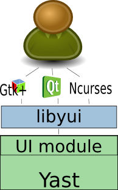
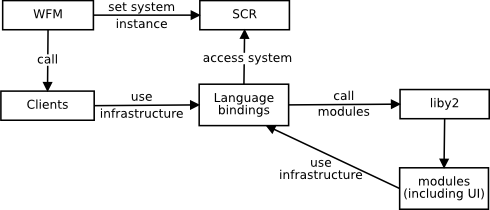

# Yast architecture

In order to be proficient with Yast development it's necessary to have a clear
view on how the Yast world is structured. The goal of this document is to
provide that view in a concise way, mentioning all the pieces and exposing how
they fit together. For a more detailed view about any of the technologies or
components, refer to the corresponding documentation linked from the central
documentation page for Yast at http://yast.github.io/.

## Overview

Yast has been invented to have an extensible and fairly standardized
means to install and manage Linux on a system. Basically Yast serves three
main purposes:

* Installation of Linux on a system
* Configuration of the installed system
* Administration of the installed system

From the point of view of software architecture, Yast is mainly a component
system in which the different pieces, that can be implemented in several
programming languages, interface with each other using a specific
protocol called YCP (Yast Communication Protocol). There are mainly two kind
of components: those providing functionality to others and the so-called
clients. The former ones publish a YCP interface with useful functions and
variables. On the other hand, a client always serves a particular purpose and
controls the execution work-flow. Clients rely on other components (including
other clients) to get the job done. Therefore, executing Yast means actually
calling a Yast client.

At the time of writing, Yast components can be written in C++ (using liby2 and
libycp), in Ruby (using
[yast-ruby-bindings](https://github.com/yast/yast-ruby-bindings)) and in Perl
(using [yast-perl-bindings](https://github.com/yast/yast-perl-bindings)), with
the exception of clients, that cannot be written in Perl. Ruby is the preferred
and recommended way, since the bindings offer some unique features for both
implementation and testing. In addition, many development tasks are automated
using the Ruby toolchain. Moreover the long term plan is to get rid of all other
languages (wherever possible) and use only Ruby.

## Main components

There are several components that have a very relevant role in Yast and must be
known in order to understand the "big picture". As already outlined in the
previous section, there are mainly two kind of components:

* Components providing functionality to others
  - [SCR](architecture.md#system-configuration-repository-scr): system configuration repository
  - [WFM](architecture.md#work-flow-manager-wfm): work-flow manager
  - [UI](architecture.md#user-interface): user interface
  - [Modules](architecture.md#modules)
* Clients

### System Configuration repository (SCR)

Most communication with the underlying system being installed or configured is
handled by a component called SCR (for System Configuration Repository). Apart
from some well-known exceptions, components are discouraged to access directly
to system files (or any other system resources, for that matter) and encouraged
to use SCR instead.

SCR is composed of several subcomponents called agents. Each agent takes care of
a very concrete type of system resource and implements a common interface with
just four operations: read, write, dir and execute.

### Work-flow manager (WFM)

The Yast work-flow manager (implemented in the WFM namespace) is a special
component which takes care of executing clients and providing to them the
interface with the other components. It's also responsible of handling one
SCR instance per every system that is being managed by Yast.

To some extend, WFM can be considered as the "bootloader" of Yast, since
every Yast execution starts with WFM handing the control over a client after
having connected it to the user interface and a SCR instance.

### User Interface

Given the wide variety of machines and use cases that can possibly be
handled with Yast, the UI component (actually just a module) provides a very
convenient abstraction layer for the user interface.

The UI component is usually referred as "UI bindings" since it basically offers
a YCP interface on top of [libyui](https://github.com/libyui/libyui), the
programming library actually implementing the different "widgets": user
interface elements such as input fields, selection lists or buttons. It is
transparent to the calling application if those widgets are part of a graphical
toolkit such as Qt or Gtk+, a text based interface using the Ncurses library or
even something else not implemented yet, as shown in the following diagram.



### Modules

Apart from the already mentioned few components with very special roles and the
clients, Yast also consists on a huge amount of other components called modules
and used to encapsulate functionality related to different areas. Examples of
available modules are Network, Service, FileSystem or PulseAudio.

### Functional diagram

As already mentioned, the Yast execution starts with WFM setting up SCR and
running a client. But that's only the start, the following diagram shows how
the different pieces interact which each other in order to get the job done.



### Some notes about the Yast Communication Protocol (YCP)

All communication between the different parts of YaST core is done via a
[predefined set of YCP data
types](https://doc.opensuse.org/projects/YaST/openSUSE11.3/tdg/id_ycp_data_types.html).
This set includes simple data types like string,
integer or boolean, but also compound data types like maps (key /
value pairs, also known as "hashes" in other programming languages) or
lists (like arrays or vectors in other programming languages). For
complex data structures, maps, lists and simple data types can be nested
to any degree.

But in addition to those common data types, YCP also
defines two types that are not so common in other programming languages:
terms and paths.

A term is something you won't find in C, Perl, Pascal or Lisp but you will
find it in functional programming languages like Prolog for example. It can be
described as a symbol followed by a list (that plays a role similar to the
list of arguments of a function call). It's mainly used in the UI code to define
tree-like structures of function calls without actually calling them.

For example, the following ruby code defines a tree of terms that will be
translated to the corresponding calls to libyui functions when needed. Every
term is defined by a symbol followed by a list of zero or more elements
(strings, symbols and other terms, in this case).

```ruby
Yast::Term.new(:VBox,
               Yast::Term.new(:Label, "Say hello..."),
               Yast::Term.new(:PushButton,
                               Yast::Term.new(:Id, :hello),
                               "now!"))
```

A path is something special to YCP and similar to paths in TCL. It's expressed
as a sequence of path elements separated by dots. Paths are designed to denote
data from complex tree-like structures and are mainly used by SCR. For example,
since the SCR agent parsing the file ```/etc/sysconfig/clock``` is attached to
the path ".sysconfig.clock", the following Ruby code can be used to reference
the value of the ```TIMEZONE``` parameter in that file.

```ruby
Yast::Path.new(".sysconfig.clock.TIMEZONE")
```

Further documentation
---------------------

The goal of this document is just to provide a high level view of the Yast
development ecosystem. More detailed documentation about the involved
technologies, tools and procedures can always be found in the central
documentation page for Yast, available at http://yast.github.io/.
